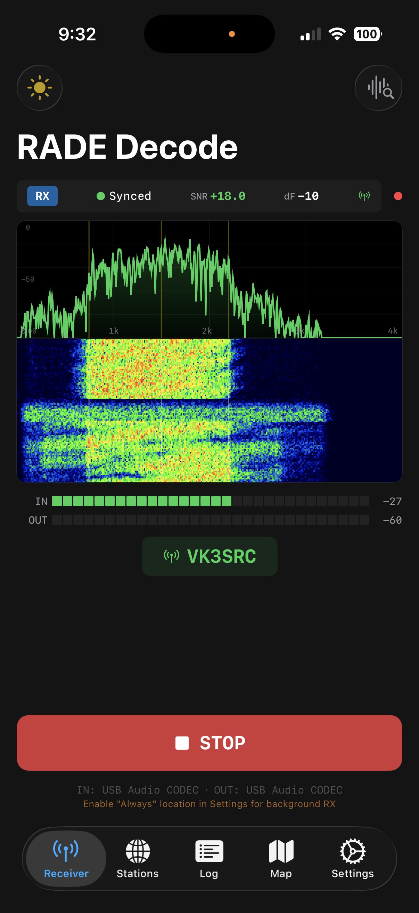

# FreeDV RADE client for iOS

## Digital voice for HF radio.

Code at: https://github.com/pepefrog1234/RADE_decode
Peter's fork: https://github.com/peterbmarks/RADE_decode

## TestFlight

https://testflight.apple.com/join/3yT3Q7h9

## Audio problem

"When the transceiver input is also built-in mic, both work without conflict. If the transceiver input is USB, iOS may not honor the re-applied input preference since the speaker override forces the built-in route — that's a fundamental iOS limitation where USB input and built-in speaker can't be used simultaneously."

